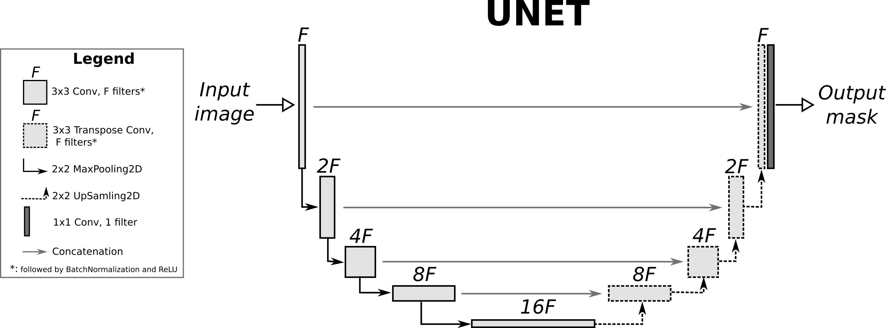

# Раскрашивание черно-белых изображений на основе сети pix2pix
**Colorizer** - нейронная модель на основе генеративно-состязательной сети pix2pix, которая позволяет раскрашивать черно-белое изображение в цветное.


## Идея разработки
Данная работа началсь с изучения уже созданных решений. После долго поиска была найдена [статья](https://arxiv.org/abs/1611.07004), в которой описана основная идея генеративно-состязательной сети pix2pix. 

**Архитектура сети содержит:**

1. Генератор с архитектурой на базе U-Net .
2. Дискриминатор, представленный свёрточным классификатором PatchGAN 


pix2pix не зависит от конкретного приложения — его можно применять для широкого круга задач, включая синтез фотографий из карт меток, создание раскрашенных фотографий из черно-белых изображений, преобразование фотографий Google Maps в аэрофотоснимки и даже преобразование эскизов в фотографий. В нашем случае направление черно-белого изображения является приоритетным.


Отправной точкой в моей разработке стала статья [«pix2pix: преобразование изображения в изображение с условным GAN»]("https://www.tensorflow.org/tutorials/generative/pix2pix?hl=ru#define_the_generator_loss"). В данной работе приложены многочисленные картинки, которые помогли мне разобраться со всей архитектурой сети, а также с принципом обучения. Данная статья описывает обучение сети для генерирования изображения фасадов зданий на TensorFlow(API Keras).

Первым шагом стал выбор фреймворка, на котором я буду решать поставленную задачу. Мой выбор пал на `PyTorch` - мощный и гибкий инструмент для разработки собственных нейронных сетей. Этот фреймворк широко используется в научных и промышленных проектах благодаря своей эффективности и удобству в использовании. Именно поэтому я решил использовать `PyTorch` для реализации моей нейронной сети.

В нашей задаче мы будем работать с пространством цветов Lab (Lab color space), которое используется для описания цветовых характеристик изображений. В этом пространстве каждый цвет представлен тремя компонентами:

1. **Канал L (Lightness)** - Он определяет яркость или светлоту цвета. Значения канала L находятся в диапазоне от 0 до 100, где 0 соответствует абсолютному черному цвету, а 100 - абсолютно белому. Этот канал отражает освещенность пикселей без учета цвета.

2. **Канал a (Green-Red)** - Этот канал определяет оттенки от зеленого до красного. Положительные значения канала a представляют красные оттенки, а отрицательные - зеленые.

3. **Канал b (Blue-Yellow)** - Канал b определяет оттенки от синего до желтого. Положительные значения канала b представляют желтые оттенки, а отрицательные - синие.


Мы подаем канал L в качестве входных данных нашей модели-генератора. Модель-генератор на основе этого канала L будет генерировать каналы ab, определяющие цветное содержание изображения. Таким образом, используя модель-генератора, мы сможем преобразовывать изображения из чб в цветные, дополняя канал L цветовой информацией каналов ab.

В качестве датасета я выбрал обрезанный набор CIFAR-10:


В статье, которую я изучал, рекомендовалось обрезать изображения до размеров 256x256 и применить аугментацию для обучающей выборки:

```python
self.transform = transforms.Compose([
    transforms.Resize((256, 256), Image.BICUBIC),
    transforms.RandomHorizontalFlip(0.5)
])
```
Кроме того, я нормализовал каналы L и ab, поскольку это позволяет нейронной сети эффективнее работать:

```python
l_channel = img_lab[[0], ...] / 50. - 1.
ab_channels = img_lab[[1, 2], ...] / 110.
```

## Написание сети
Для начала моей работы над сетью я решил воплотить U-Net подобную архитектуру (**генератор**). В структуре моего проекта вы можете найти папку **components**, в которой содержатся основные компоненты для реализации U-Net (generator_net.py).



На данной схеме изображен принцип работы сети. В моей реализации свертки имеют размер ядра 4х4.

Далее я написал **дискриминатор**:

```python
class PatchDiscriminator(nn.Module):
    def __init__(self, input_channels):
        super(PatchDiscriminator, self).__init__()
        self.conv_1 = DownBlock(3, 64, use_batch_norm=False)
        self.conv_2 = DownBlock(64, 128)
        self.conv_3 = DownBlock(128, 256)
        self.conv_4 = DownBlock(256, 512)
        self.zero_pad = nn.ZeroPad2d((1, 0, 1, 0))
        self.final_layer = nn.Conv2d(512, 1, kernel_size=4, padding=1)

    def forward(self, x):
        x = self.conv_1(x)
        x = self.conv_2(x)
        x = self.conv_3(x)
        x = self.conv_4(x)
        x = self.zero_pad(x)
        x = self.final_layer(x)
        return x
```

