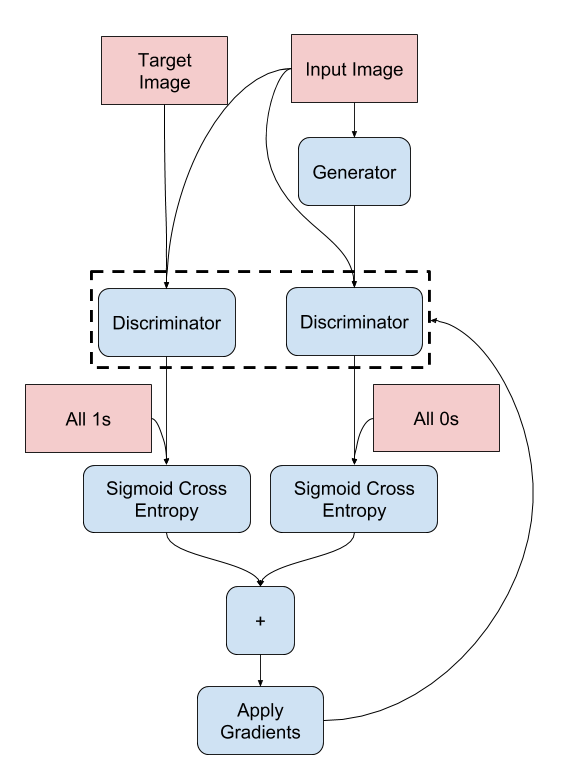

# Раскрашивание черно-белых изображений на основе сети pix2pix

[](https://drive.google.com/file/d/1XG9yq5OmEIbFp77FnRghtZKmok_TGzKf/view?usp=sharing)


**Colorizer** - нейронная модель на основе генеративно-состязательной сети pix2pix, которая позволяет раскрашивать черно-белое изображение в цветное.


## Использование 
1. Установите все нужные зависимости (файл requiments.txt)

2. Запустите консоль и перейдите в папку с проектом

3. Введите в консоль следующие парметры:
    * image_path (str) - Путь к изображению;
    * device (str) - Устройство для обработки (cpu или cuda);
    * save_image (bool) - Флаг для сохранения изображения.

```bash
python main.py --image_path ВАШ_ПУТЬ_К_ФОТО --device cuda --save_image False
```
Примечание: В данный момент реализация работает только с использованием CUDA. Пожалуйста, убедитесь, что у вас установлен фреймворк [PyTorch](https://pytorch.org/) с поддержкой CUDA. Вы можете проверить доступность CUDA с помощью следующего кода:

```python
import torch 

torch.cuda.is_available() # Вернет значение True или False
```
Если этот код возвращает `True`, то CUDA доступен на вашем устройстве.


## Идея разработки
Данная работа началсь с изучения уже созданных решений. После долго поиска была найдена [статья](https://arxiv.org/abs/1611.07004), в которой описана основная идея генеративно-состязательной сети pix2pix. 

**Архитектура сети содержит:**

1. Генератор с архитектурой на базе U-Net .
2. Дискриминатор, представленный свёрточным классификатором PatchGAN 


pix2pix не зависит от конкретного приложения — его можно применять для широкого круга задач, включая синтез фотографий из карт меток, создание раскрашенных фотографий из черно-белых изображений, преобразование фотографий Google Maps в аэрофотоснимки и даже преобразование эскизов в фотографий. В нашем случае направление черно-белого изображения является приоритетным.


Отправной точкой в моей разработке стала статья [«pix2pix: преобразование изображения в изображение с условным GAN»](https://www.tensorflow.org/tutorials/generative/pix2pix?hl=ru#define_the_generator_loss). В данной работе приложены многочисленные картинки, которые помогли мне разобраться со всей архитектурой сети, а также с принципом обучения. Данная статья описывает обучение сети для генерирования изображения фасадов зданий на TensorFlow(API Keras).

Первым шагом стал выбор фреймворка, на котором я буду решать поставленную задачу. Мой выбор пал на `PyTorch` - мощный и гибкий инструмент для разработки собственных нейронных сетей. Этот фреймворк широко используется в научных и промышленных проектах благодаря своей эффективности и удобству в использовании. Именно поэтому я решил использовать `PyTorch` для реализации моей нейронной сети.

В нашей задаче мы будем работать с пространством цветов Lab (Lab color space), которое используется для описания цветовых характеристик изображений. В этом пространстве каждый цвет представлен тремя компонентами:

1. **Канал L (Lightness)** - Он определяет яркость или светлоту цвета. Значения канала L находятся в диапазоне от 0 до 100, где 0 соответствует абсолютному черному цвету, а 100 - абсолютно белому. Этот канал отражает освещенность пикселей без учета цвета.

2. **Канал a (Green-Red)** - Этот канал определяет оттенки от зеленого до красного. Положительные значения канала a представляют красные оттенки, а отрицательные - зеленые.

3. **Канал b (Blue-Yellow)** - Канал b определяет оттенки от синего до желтого. Положительные значения канала b представляют желтые оттенки, а отрицательные - синие.


Мы подаем канал L в качестве входных данных нашей модели-генератора. Модель-генератор на основе этого канала L будет генерировать каналы ab, определяющие цветное содержание изображения. Таким образом, используя модель-генератора, мы сможем преобразовывать изображения из чб в цветные, дополняя канал L цветовой информацией каналов ab.

В качестве датасета я выбрал обрезанный набор CIFAR-10:


В статье, которую я изучал, рекомендовалось обрезать изображения до размеров 256x256 и применить аугментацию для обучающей выборки:

```python
self.transform = transforms.Compose([
    transforms.Resize((256, 256), Image.BICUBIC),
    transforms.RandomHorizontalFlip(0.5)
])
```
Кроме того, я нормализовал каналы L и ab, поскольку это позволяет нейронной сети эффективнее работать:

```python
l_channel = img_lab[[0], ...] / 50. - 1.
ab_channels = img_lab[[1, 2], ...] / 110.
```

## Написание сети
Для начала моей работы над сетью я решил воплотить U-Net подобную архитектуру (**генератор**). В структуре моего проекта вы можете найти папку **components**, в которой содержатся основные компоненты для реализации U-Net (generator_net.py).


На данной схеме изображен принцип работы сети. В моей реализации свертки имеют размер ядра 4х4, а также отсутствует применение операции пулинга.

После этого я приступил к написанию **дискриминатора**:

```python
class PatchDiscriminator(nn.Module):
    def __init__(self, input_channels):
        super(PatchDiscriminator, self).__init__()
        self.conv_1 = DownBlock(3, 64, use_batch_norm=False)
        self.conv_2 = DownBlock(64, 128)
        self.conv_3 = DownBlock(128, 256)
        self.conv_4 = DownBlock(256, 512)
        self.zero_pad = nn.ZeroPad2d((1, 0, 1, 0))
        self.final_layer = nn.Conv2d(512, 1, kernel_size=4, padding=1)

    def forward(self, x):
        x = self.conv_1(x)
        x = self.conv_2(x)
        x = self.conv_3(x)
        x = self.conv_4(x)
        x = self.zero_pad(x)
        x = self.final_layer(x)
        return x
```

Я проинициализировал веса всех сверток, устанавливая среднее значение равным 0 и стандартное отклонение равным 0.02.

## Функция потерь GAN
На следующем этапе мы определили функцию потерь для нашей модели GAN. В ее основе лежит бинарная кросс-энтропия, которая широко используется в обучении моделей для бинарной классификации. Эта функция поможет нам оценить, насколько хорошо наши модели справляются с задачей различения между реальными и сгенерированными данными: 
```python
class GANLoss(nn.Module):
    def __init__(self, real_label=1.0, fake_label=0.0, mode="vanilla", target="real"):
        super(GANLoss, self).__init__()
        self.register_buffer("real_labels", torch.tensor(real_label))
        self.register_buffer("fake_labels", torch.tensor(fake_label))

        if mode == "vanilla":
            self.loss = nn.BCEWithLogitsLoss()
        else:
            self.loss = nn.MSELoss()

    def __call__(self, predictions, target_is_real):
        if target_is_real:
            labels = self.real_labels
        else:
            labels = self.fake_labels
        labels = labels.expand_as(predictions)

        return self.loss(predictions, labels)
```
В этой функции мы также создаем массив, заполненный либо единицами (если цель - реальные данные) либо нулями (если цель - сгенерированные данные), который будет использоваться для сравнения с предсказаниями модели. Таким образом, мы можем легко оценить, насколько хорошо модель справляется с задачей классификации данных на реальные и сгенерированные.

## Конструирование модели

После написания всех необходимых модулей, наступает время объединить их в единое целое. 

<table>
<tr>
<td></td>
<td></td>
</tr>
</table>
На левой стороне показана последовательность действий при обучении генератора, а на правой - схема обучения дискриминатора.

Файл `model.py` объединяет все эти идеи в одну модель.

## Обучение модели
Модель обучалась на сервисе Kaggle с использованием GPU P100. Каждая эпоха занимала примерно 30 секунд.

Функция visualize_work_model используется для отображения результатов обучения модели каждые 10 эпох. На каждой итерации выводятся три строки изображений:

1. Черно-белое фото.
2. Изображение с примененными к нему сгенерированными цветами.
3. Оригинальное цветное изображение.

```python
EPOCHS = 120
model = Model(device).to(device)

def training_loop(model, train_loader, num_epochs):
    for epoch in range(num_epochs):
        for data in tqdm(train_loader):
            model.setup_input(data)
            model.optimize()
        if epoch % 10 == 0:
            visualize_work_model(model, data)

        print(f"[{epoch+1}/{num_epochs}]: Complite!")
```

### Визуализация во время обучения


## Итоговый инференс
После завершения обучения я сохранил веса модели, которые доступны для загрузки по ссылке в папке `weights/`.

Итоговый процесс вывода предсказаний модели выглядит следующим образом:


## Благодарность
Отдельное спасибо за вклад и вдохновение, которое дал этот [репозиторий](https://github.com/mberkay0/image-colorization?tab=readme-ov-file). Благодаря его содержанию я смог использовать и адаптировать некоторые участки кода, такие как реализация функции потерь GANLoss и структура модели Model.
